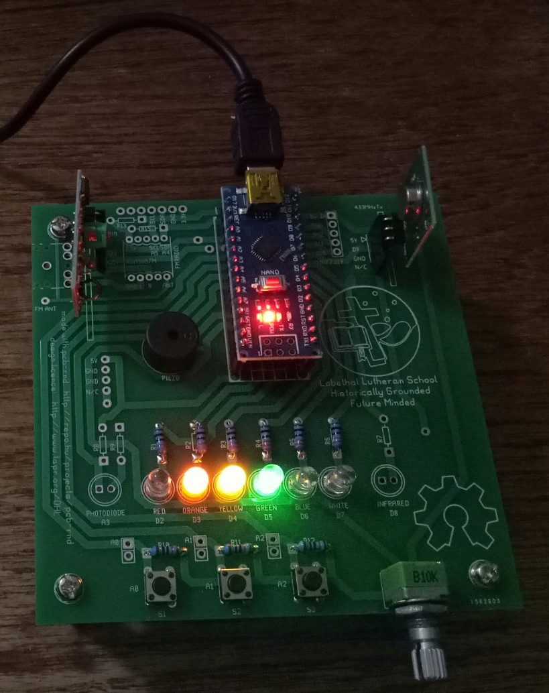

# LLS-Nano-Development-Board
A development board for the Arduino Nano

Schematic and design files for a development board that can be used to teach coding with the Arduino IDE.

The current example sketch demonstrates:

- speed control with the 10k potentiometer
- S1 (A0) selects LED sweep mode and changes LED sweep direction
- S2 (A1) selects a Cylon like LED sweep mode
- S3 (A2) selects an LED flash mode

The design licence is the TAPR Open Hardware Licence.

Code is licenced with the GPL v2.0
